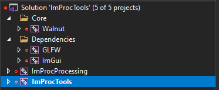

# ImProc Toolbox

ImProc Toolbox is a simple application and a graphical interface to the [ImProcProcessing](https://github.com/KamelOtmani/ImProcProcessing) library.

It was intended to be used in my 5 months internship at IFPEN to process high amount of data (1.6 TB !!) from high-speed camera footage efficiently. The algorithm is used to detect the contour of cylindrical particles (the shape shouldn't really matter much, but it was only tested with cylindrical particles).

Please check [ImProcProcessing](https://github.com/KamelOtmani/ImProcProcessing) docs for more detailed look into the algorithm.

This application uses the Vulkan sdk!

Currently, supports Windows only (as we didn't test other OSs, nothing to limit this application to Windows only as it was designed with multiplatform in mind !).

The Setup script support Visual Studio 2019 by default.


_<center>Batch processing example </center>_

## Requirements
- [Visual Studio 2019](https://visualstudio.com) (not strictly required you can use 2022 version, however included setup scripts only support this)
- [Vulkan SDK](https://vulkan.lunarg.com/sdk/home#windows) (preferably a recent version)
- [OpenCV](https://opencv.org/)

## Getting Started
You need to install first the Vulkan SDK. And for opencv, we recommend using a package manager like vcpkg (it integrates neatly with Visual Studio). To do this, install [vcpkg](https://vcpkg.io/en/getting-started.html) and then install opencv by typing this in the PowerShell (or the terminal of your choice)

```
vcpkg install opencv
```

Once you've cloned, run `scripts/Setup.bat` to generate Visual Studio 2019 solution/project files. 
You will see the solution file. Open it and you will see this project structure: 

### Project structure & Dependencies
- [ImProcProcessing](https://github.com/KamelOtmani/ImProcProcessing) : the image processing library used
- [Walnut](https://github.com/TheCherno/Walnut) : the application framework (graphical interface & Vulkan)

## Main Features : 
- Multithreaded processing of the images
- Batch processing : batch process multiple recordings with the same setting
- Background Extraction tool : calculate the background of the given image sequence (simple calculate the mean)
- Previewing images sequences
- Live preview of the processing result (the final binary image)
- Output the intermediate results (the binary image)
- Output the final results (particle position, orientation ..) in CSV format.

**NOTE** :
For now, this project is in a *somewhat* stable configuration and can process the data that we had, so this project is on hold. If anyone is interested in improving, open some pull request or contact me!
## Future development 
Nice features to have :
- Multithread the UI so it isn't frozen when processing. It could give better feedback (right now the progress is printed in the console, and this may impact a bit the performance as cout is not thread safe !).
- Expand the result viewer
- Port the python node editor into the toolbox
- a better theme would be nice to have
- clean the code 
- write documentation for the tools.
- refactoring (yes, the code isn't the cleanest ^^).

### 3rd party libraries
- [Dear ImGui](https://github.com/ocornut/imgui)
- [GLFW](https://github.com/glfw/glfw)
- [stb_image](https://github.com/nothings/stb)
- [GLM](https://github.com/g-truc/glm) (included for convenience)

### Additional
- Walnut uses the [Roboto](https://fonts.google.com/specimen/Roboto) font ([Apache License, Version 2.0](https://www.apache.org/licenses/LICENSE-2.0))